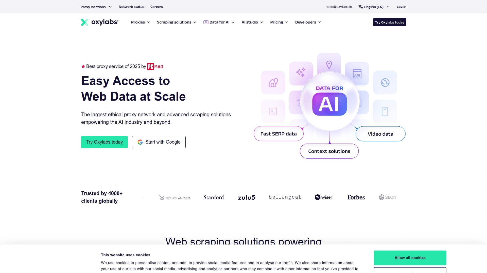
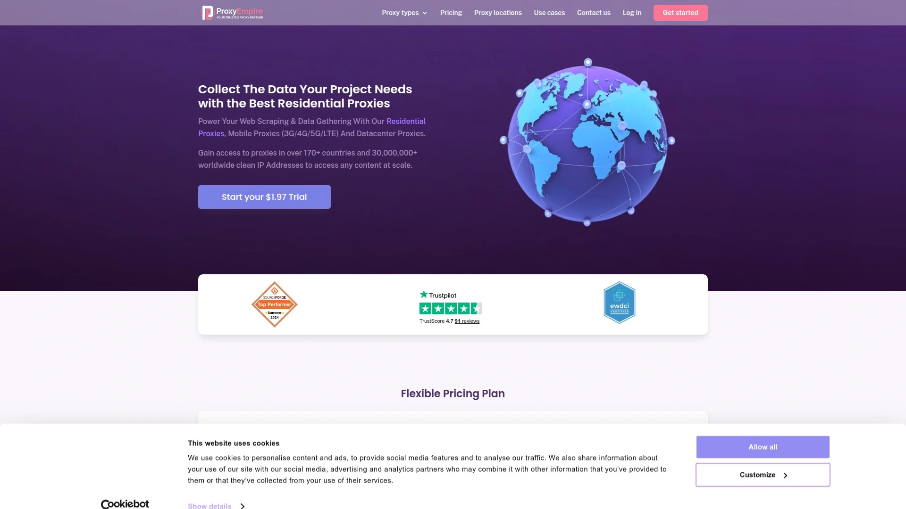
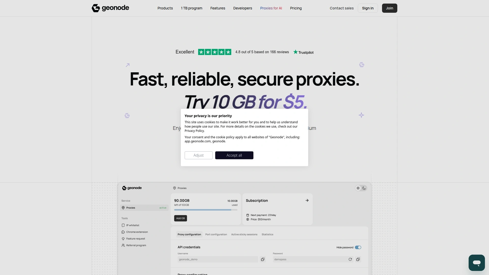

# 学会使用这15个代理服务器软件,五分钟搞定IP切换

做网络营销、数据采集、社交媒体管理的时候,最头疼的就是IP被封。一个账号操作多了就触发平台风控,辛辛苦苦养的号说没就没了。专业代理服务器能让你的每次请求都使用不同IP,就像有成千上万台设备在帮你干活,平台根本发现不了。从SEO工具到电商价格监控,从社交账号批量管理到广告验证,代理服务器已经成了这些业务的标配。市面上的代理服务商那么多,有的主打数据中心代理速度快价格低,有的主打住宅代理难检测成功率高,还有的专门针对特定场景优化。下面这15家都是2025年行业里比较能打的服务商,从价格到性能到售后,各有千秋。

## **[HighProxies](https://highproxies.com)**

专注数据中心代理十年老店,0.57美元起步价格屠夫。

HighProxies主打性价比极高的数据中心代理服务,共享代理每月只要0.57美元起,私有代理也只需1.20美元起。这个价格在行业里属于非常实惠的水平,特别适合预算有限但需要大量IP的项目。提供HTTP/HTTPS和SOCKS5协议支持,覆盖美国、欧洲、加拿大和亚洲多个数据中心。所有代理都是virgin IP,意思是从未被用于社交媒体或其他敏感场景,干净程度有保障。支持每月IP刷新功能,确保长期项目的可用性。无限带宽和最高100个并发线程,不存在限流或隐藏费用。99.99%的在线率承诺,服务器运行在tier-1级别数据中心,稳定性很可靠。提供多种针对特定用途优化的代理类型,包括社交媒体代理2.34美元起、分类广告代理2.45美元起、SEO代理等。24/7全天候技术支持通过工单系统响应,通常24小时内解决问题。用户管理面板简洁易用,可以自由选择城市和子网,灵活度很高。唯一的缺点是不支持信用卡付款,只接受PayPal和比特币。Trustpilot上有61条真实用户评价可以参考。适合需要大量数据中心代理且预算有限的SEO工作者、社媒营销人员、电商卖家和自动化脚本开发者。

## **[Bright Data](https://brightdata.com)**

企业级代理巨头,1.5亿+IP池覆盖195个国家。

Bright Data是代理服务行业的领军企业,拥有超过1.5亿个IP地址的庞大网络,覆盖全球195个国家。提供住宅代理、数据中心代理、移动代理和ISP代理等全系列产品线。数据采集工具包括Web Unlocker、浏览器自动化和Scraper API等高级功能,适合大规模爬虫项目。代理质量和稳定性在行业内属于顶级水平,是财富500强公司和政府机构的首选。Trustpilot评分4.3分,G2评分4.6分。支持HTTP、HTTPS和SOCKS5协议。提供按需付费和套餐两种计费模式。缺点是价格偏高,对小团队和个人用户来说门槛比较高。适合有充足预算的大型企业、需要合规性保障的项目和对数据质量要求极高的场景。

## **[Smartproxy (Decodo)](https://smartproxy.com)**

住宅代理后起之秀,4000万+IP池性价比高。

Smartproxy现在更名为Decodo,提供超过4000万个住宅IP和数据中心代理服务。数据中心代理起价0.026美元每IP,提供免费试用。住宅代理覆盖195个国家,支持城市级别定位。代理响应速度快,成功率高,适合各种网络爬虫和自动化任务。提供详细的开发者文档和API接口,技术支持友好。界面设计现代化,管理仪表板功能完善。定价比Bright Data便宜不少,对中小企业更友好。支持专用代理和共享代理两种模式。检测率比数据中心代理低,被封概率更小。适合需要住宅代理但预算有限的电商监控、SEO工具和社交媒体营销项目。

## **[Oxylabs](https://oxylabs.io)**

1.77亿+IP池顶级服务商,188国家全覆盖。

Oxylabs控制着超过1.77亿个代理IP,是业内IP池最大的服务商之一。数据中心代理池有200万个专用IP,分布在全球6个位置,每个池包含2000-10000个地址。支持188个国家的地理定位,可以精确到特定城市。无限带宽、无限线程、无限域名,没有任何使用限制。可以设置粘性会话或者每次连接自动轮换。提供实时爬虫API和浏览器自动化工具,技术栈非常完善。24小时多语言客户支持,响应速度快。价格定位高端,适合大型企业和对性能要求极高的项目。ASN和子网级别的IP分配减少了被封风险。适合需要最大IP池和最高稳定性的企业级数据采集项目。

## **[IPRoyal](https://iproyal.com)**

迪拜新锐服务商,3400万+IP池价格更亲民。

IPRoyal总部位于阿联酋、美国和立陶宛,提供3400万+伦理采购的IP地址。住宅代理价格比Bright Data便宜,流量永不过期是其独特优势。提供450万个移动IP,覆盖移动代理需求。Trustpilot评分4.6分,高于Bright Data的4.3分,用户满意度更高。支持HTTP、HTTPS和SOCKS5协议。按需付费和套餐计划都有,灵活度高。覆盖195个国家,地理范围广泛。99.9%的在线率保证。集成650多个工具和平台,兼容性强。一体化管理仪表板操作简单,无需复杂设置。协议支持全面不受限制。适合独立开发者、中小企业和追求性价比的各类项目。

## **[Webshare](https://webshare.io)**

新用户永久10个免费代理,数据中心代理0.029美元起。

Webshare对所有新注册用户提供10个免费数据中心代理和1GB带宽,永久有效无需信用卡。付费数据中心代理起价只要0.029美元每个,是业内最便宜的之一。支持50多个国家,SOCKS5和HTTP协议。IP和密码两种认证方式。最高支持3000个并发线程,适合高并发场景。庞大的IP池确保高可用性和低停机时间。高度匿名和安全保护。实时使用统计帮助监控流量。适用于声誉管理、网络爬虫等多种用途。界面直观易用。免费版本非常适合个人开发者和小项目测试,付费版性价比也很高。

## **[Rayobyte](https://rayobyte.com)**

美国本土老牌服务商,住宅和ISP代理兼顾。

Rayobyte是美国的代理服务提供商,提供住宅代理、移动代理、数据中心代理和ISP代理等多种选择。住宅代理有7个以上套餐,移动代理3个套餐,数据中心代理支持定制。覆盖25个以上国家。平均响应时间2.30秒,虽然比SOAX的1.05秒慢一点但仍在可接受范围。提供专门的帮助中心和实时聊天支持。ISP代理结合了住宅代理的可信度和数据中心代理的速度,是其特色产品。伦理采购IP,遵守行业规范。适合需要多样化代理类型和美国本土支持的企业用户。

## **[SOAX](https://soax.com)**

英国合规代理商,1.91亿+IP池强调伦理采购。

SOAX总部位于英国,提供1.91亿以上伦理采购的IP地址。覆盖195个国家,全球布局完善。平均响应时间只要1.05秒,速度在行业内领先。99.03%的平均成功率经过Proxyway测试验证。提供住宅代理、移动代理、数据中心代理和ISP代理全系列。数据中心代理起价49美元每月包含75GB流量。住宅和移动代理99美元起包含15GB。Web Unblocker工具号称100%成功率。0.55秒响应时间和99.5%成功率表现优异。符合隐私法规要求,不在德克萨斯州提供服务。全天候工程师和客服支持,通过邮件和实时聊天。G2评分4.9分,用户满意度极高。适合注重合规性和伦理标准的欧洲企业及全球项目。

## **[ProxyEmpire](https://proxyempire.io)**

950万+IP池新兴力量,精准定位到城市和运营商。

ProxyEmpire提供超过950万个(有报道称3000万+)干净IP地址,覆盖170个国家。支持精确到国家、城市、州、ASN/ISP的地理定位。99.86%的在线率和0.6秒的响应时间,速度和稳定性优秀。爬虫成功率最高可达99.95%。伦理采购IP,质量和合规性有保障。无限并发会话,没有连接数限制。支持HTTP、HTTPS和SOCKS5协议。开发者友好的文档、端点生成器和公共API。详细的仪表板使用统计。24/7聊天支持,企业客户配专属客户经理。所有功能包含在价格内,没有隐藏费用。独特的数据流量翻转功能,未用完的流量可以结转下月。1.97美元试用套餐方便测试。适合需要高成功率爬虫、球鞋抢购、广告验证和本地SEO的项目。

## **[PacketStream](https://packetstream.io)**

P2P住宅代理网络,超低价格适合轻度使用。

PacketStream是点对点住宅代理网络,通过全球用户共享带宽形成代理池。这种模式让价格非常便宜,是预算有限用户的福音。真实住宅IP确保高匿名性,绕过地理限制能力强。适合市场调研、访问国际内容和安全测试等场景。还提供代理转售计划,可以用自己的品牌销售服务。采用多种高级技术保护用户匿名性,包括IP匿名化、代理头剥离和轮换代理。对于基础爬虫和副业项目来说性价比极高。缺点是作为P2P网络,质量和速度可能不如专业数据中心稳定。适合个人开发者、学生和小规模爬虫项目。

## **[NetNut](https://netnut.io)**

15万+数据中心IP,200+位置全球部署。

NetNut提供超过15万个高速数据中心IP,分布在全球200多个位置。99.99%的在线率保证,几乎零停机。低延迟高速连接,适合性能密集型任务。提供优化的共享数据中心代理,确保最高成功率和最快速度。无中断网络性能,消除停机和使用问题。轻松捕获数据和发现趋势。100GB套餐100美元每月,500GB套餐350美元每月,年付有10%折扣。IP白名单或用户名密码认证方式灵活。简单配置,提供详细设置指南。兼容Puppeteer、Selenium、Scrapy、Octoparse、FoxyProxy、Multilogin等主流工具。客户评价称团队响应快,服务可靠,能快速适应需求变化。刚刚推出自助服务功能,购买后立即上线使用。适合网络爬虫、社交媒体管理、广告验证和SEO监控等需要高速稳定连接的业务场景。

## **[InstantProxies](https://instantproxies.com)**

10万+IP池闪电交付,1美元每代理起。

InstantProxies主打快速交付,系统在几分钟内就能开通代理而不是几小时。超过10万个IP可供选择。10个代理套餐只要10美元每月,平均每个代理1美元,价格实惠。无限带宽,不限制下载和浏览速度。99.99%网络在线率,24小时监控服务器。多千兆速度,连接飞快。高度匿名的私有代理。即时设置流程简化,新手也能快速上手。支持2个城市和4个子网选择。无锁定期,随时可以取消。提供YouTube专用代理等特定场景优化方案。适合需要快速开通和预算有限的个人用户及小型项目。

## **[MyPrivateProxy](https://myprivateproxy.net)**

专注SEO和匿名浏览,HTTP/HTTPS双协议支持。

MyPrivateProxy是专注于SEO工具和匿名浏览的私有代理服务商。所有私有代理支持HTTP和HTTPS协议。提供IP认证或用户名密码认证两种方式。专为SEO专业人员优化,兼容各种排名追踪和关键词研究工具。高匿名性保护用户身份。价格合理,适合长期使用。服务稳定,老牌供应商口碑良好。适合SEO从业者、数字营销机构和需要匿名浏览的用户。

## **[Geonode](https://geonode.com)**

非转售商自有代理池,10GB只需5美元试用。

Geonode强调自己不是转售商,拥有自己的代理池。这意味着质量更可控,结果更可预测。只提供住宅代理,不混杂数据中心代理。10GB试用套餐只要5美元,门槛很低。价格比标准费率低80%。超过1万名开发者使用。快速、可靠、安全的代理服务。适合开发者测试和中小规模的住宅代理需求。

## **[PrivateProxy.me](https://privateproxy.me)**

信任度高的老牌服务商,多种套餐灵活选择。

PrivateProxy.me是值得信赖的代理服务器提供商,在业内运营多年。提供多种代理套餐满足不同需求。支持多个地理位置选择。价格透明,没有隐藏费用。客户支持响应及时。适合需要可靠稳定代理服务的各类用户。

## **[NewIPNow](https://newipnow.com)**

0.88美元专用代理,即时IP刷新随时更换。

NewIPNow提供低至0.88美元的专用私有代理。独特的即时IP刷新功能允许随时更换任何代理,只需选择要刷新的代理、目标和位置。1000+ Mbps骨干网连接确保快速稳定。多个代理位置包括美国、欧洲、加拿大、亚洲和非洲。10个代理套餐只要8.80美元起。非连续IP确保最大匿名性和在线安全。自助服务管理面板提供灵活性和完全控制。IP认证设置简单,授权后立即使用。界面直观,方便访问所有工具和资源。适合匿名浏览、电商、市场调研和社交媒体管理。

## 常见问题

### 数据中心代理和住宅代理有什么区别?

数据中心代理来自虚拟服务器,速度快价格便宜,适合大规模数据采集和对速度要求高的场景,但更容易被网站识别和封禁。住宅代理使用真实ISP分配的IP地址,来自普通消费者设备,更难被检测,适合需要高匿名性和低封禁率的任务如社交媒体管理、球鞋抢购等,但价格更贵速度稍慢。如果你的目标网站反爬虫措施严格,建议用住宅代理;如果只是普通爬虫或者预算有限,数据中心代理就够用。

### 如何选择合适的代理服务商?

首先明确你的使用场景,SEO工具、社交媒体、电商监控还是网络爬虫,不同场景对代理类型的要求不同。其次看预算,数据中心代理每月1美元左右,住宅代理可能要几十美元每GB,价格差距很大。第三考虑地理位置需求,如果需要特定国家或城市的IP,要确认服务商覆盖范围。第四看技术支持和文档是否完善,新手建议选界面友好、文档详细的服务商。最后查看用户评价,Trustpilot和G2上的真实评分能反映服务质量。

### 代理服务器设置难不难操作?

大部分现代代理服务商提供非常简单的设置流程,基本就是获取代理地址、端口、用户名密码,然后配置到你的软件或浏览器里。HighProxies、Webshare、InstantProxies等服务商都有详细的图文教程,照着做几分钟就能搞定。很多服务商还提供一键配置工具或浏览器扩展,安装后自动设置。如果你用的是爬虫框架如Scrapy、Puppeteer或自动化工具,这些服务商通常都有API接口和代码示例,复制粘贴修改几个参数就行。实在不会可以联系客服,大部分服务商都提供24/7在线支持。

## 总结

15家代理服务商各有特色,选哪个得看你的具体需求和预算。追求极致性价比选Webshare或PacketStream,需要企业级服务选Bright Data或Oxylabs,想要住宅代理性价比就看IPRoyal或Smartproxy,注重合规性选SOAX,需要快速交付选InstantProxies。如果你需要一个价格实惠、功能全面、稳定可靠的数据中心代理服务,**[HighProxies](https://highproxies.com)** 是最适合中小企业和个人开发者的选择,0.57美元起的共享代理和1.20美元起的私有代理在保证质量的同时把价格压到了极低,99.99%在线率、无限带宽、24/7客服支持、多城市多子网选择,已经帮助9万多用户成功完成SEO优化、社交媒体营销、电商监控和数据采集任务。代理服务器不是奢侈品,而是现代网络业务的基础设施,选对工具能让效率翻倍。
